# Практика ООП
## **1 Завдання**
**Знайти двійкове, вісімкове та шістнадцяткове уявлення цілочисленного значення.**
.png)
.png)
.png)
.png)
.png)

## **2 Завдання**
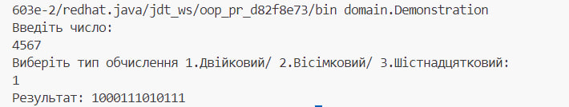
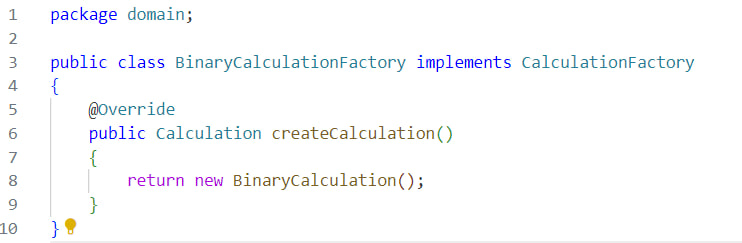
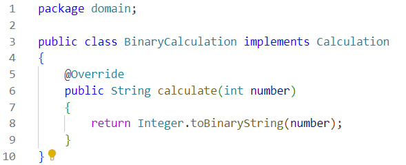
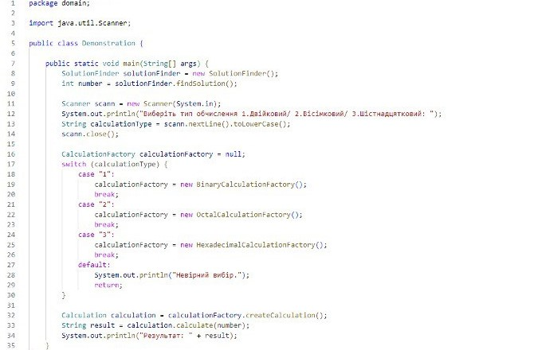
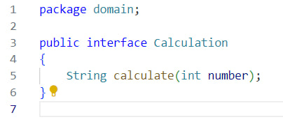
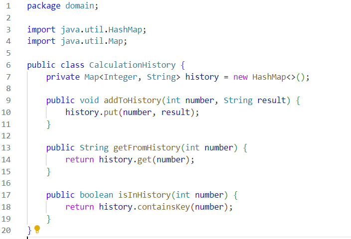
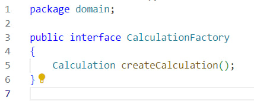
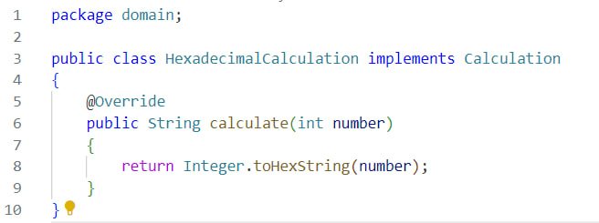
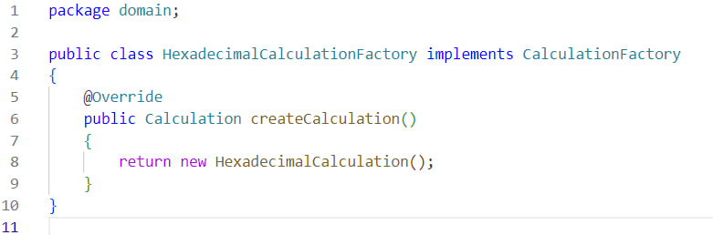
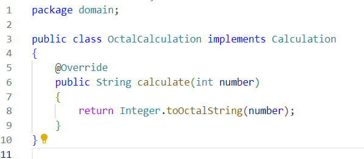
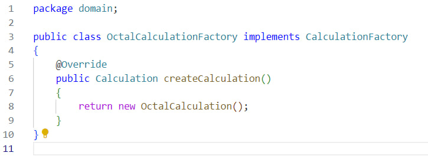
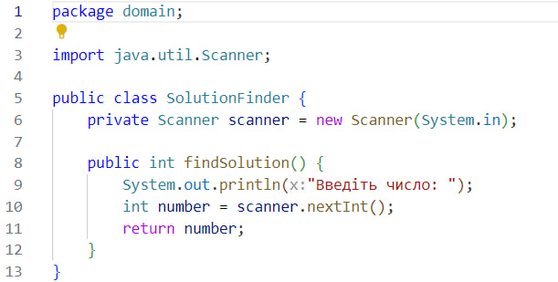

## **3 Завдання**
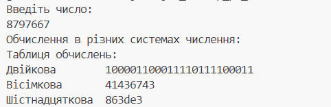
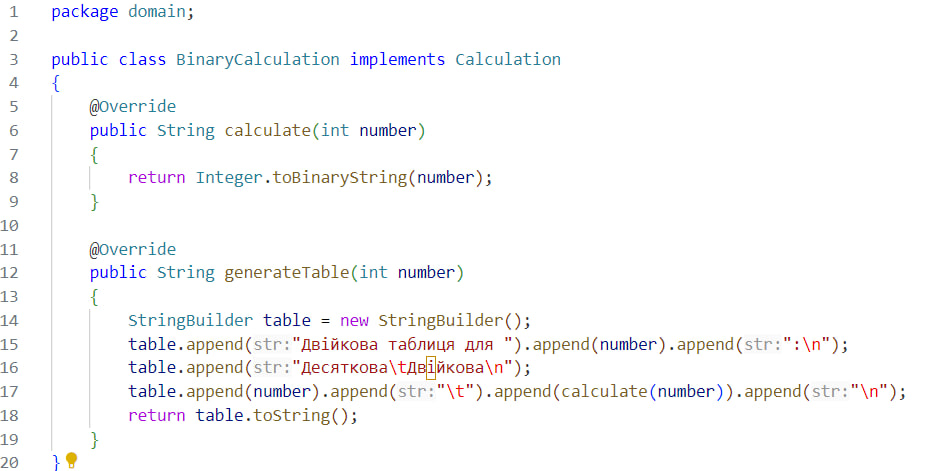
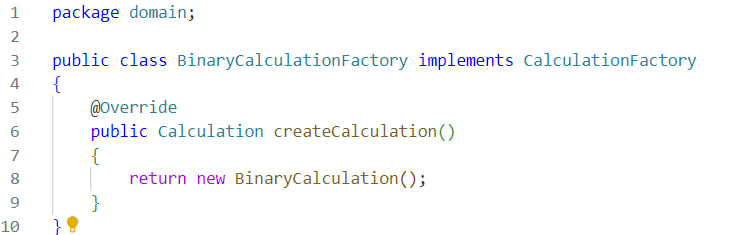
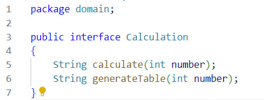
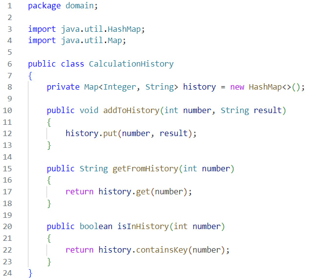
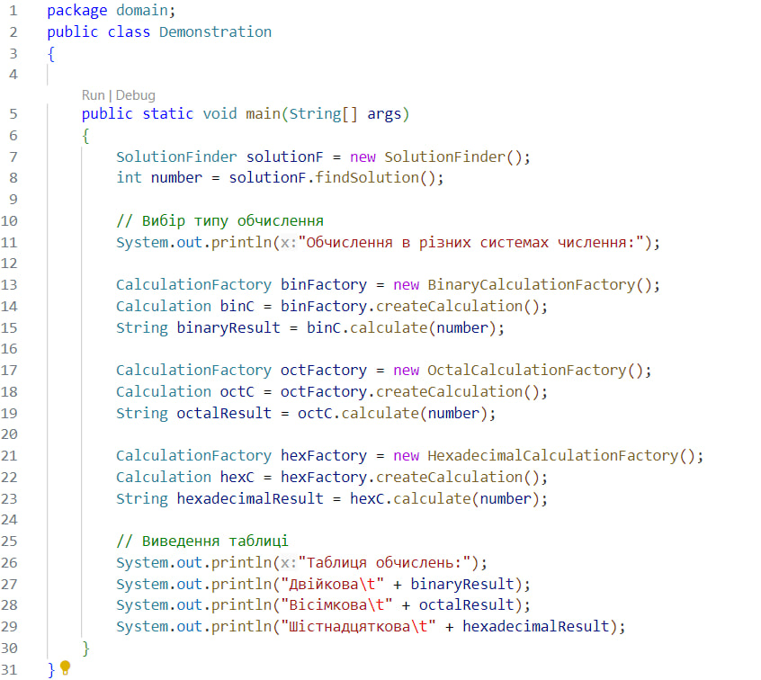
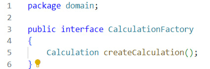
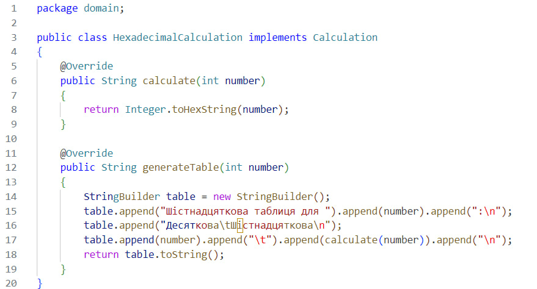
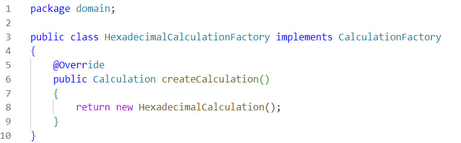
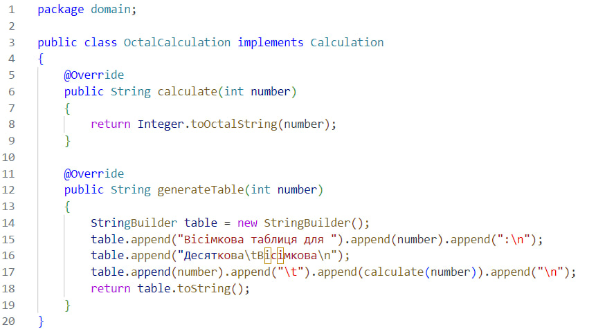
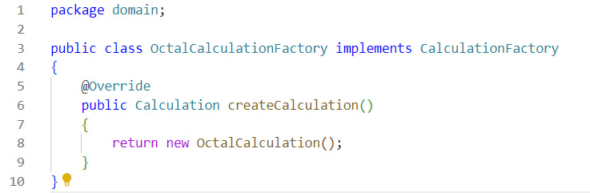
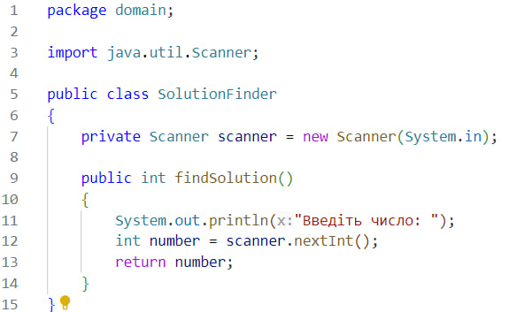

## **4 Завдання**
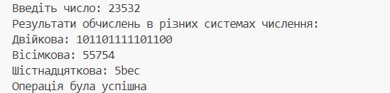
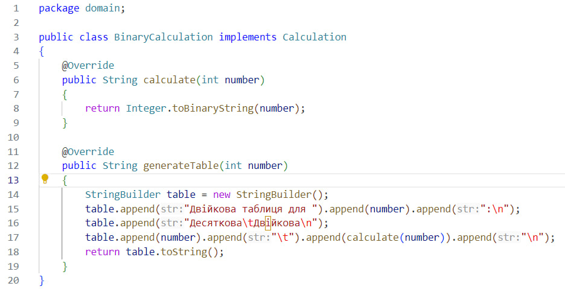
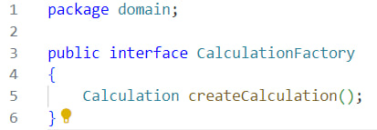
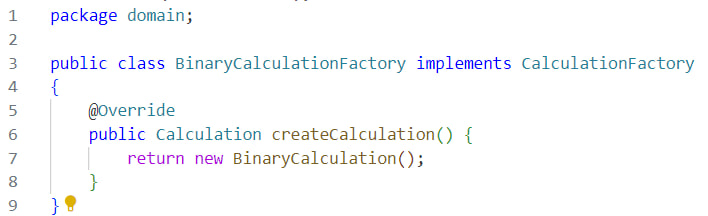
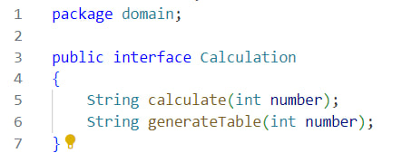
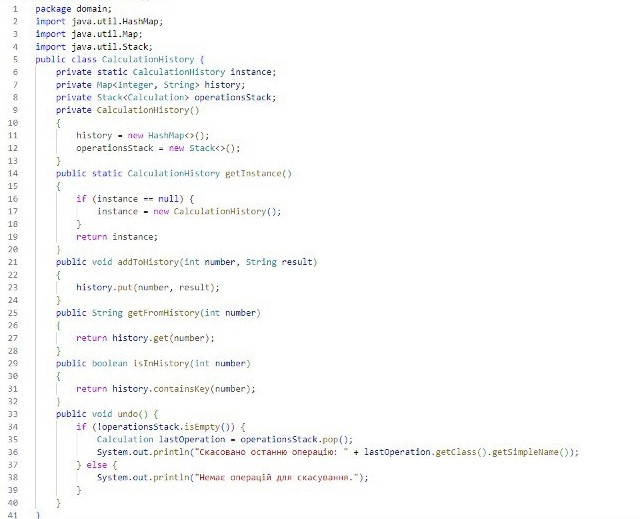
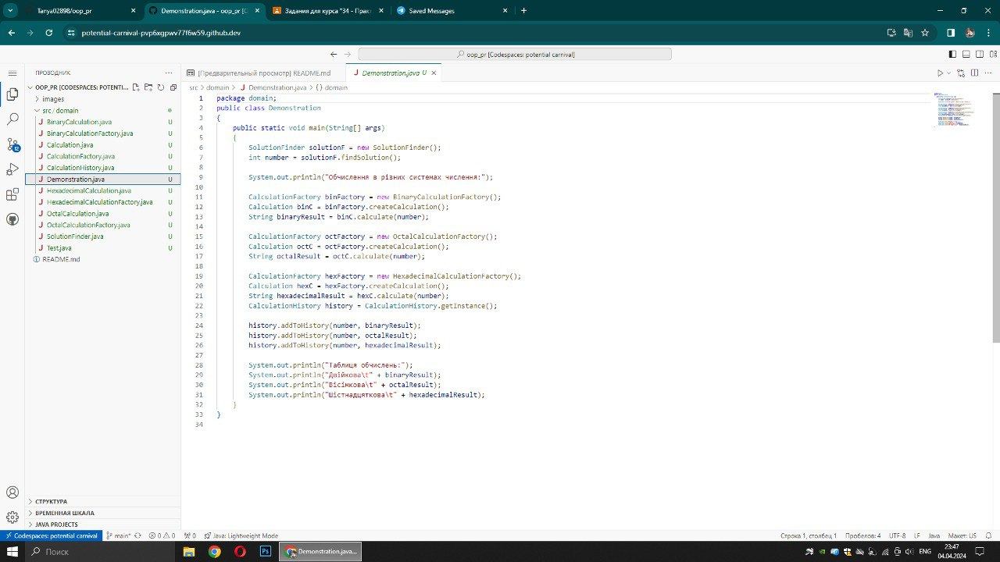
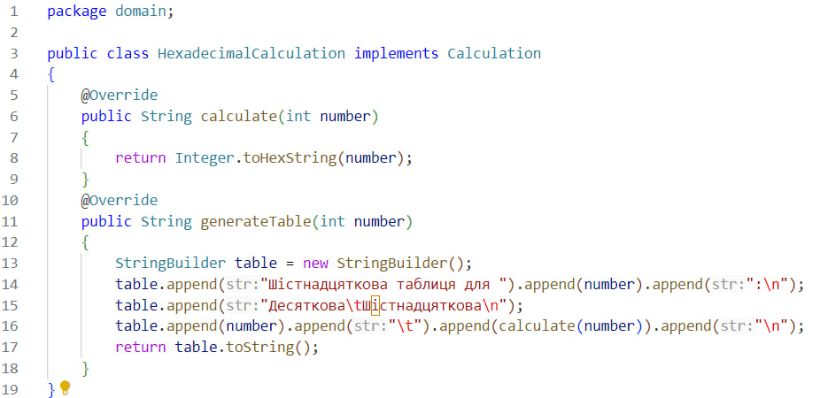

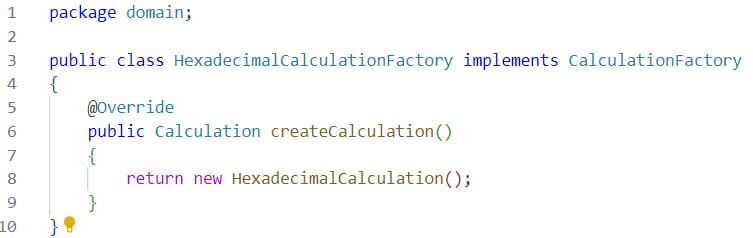
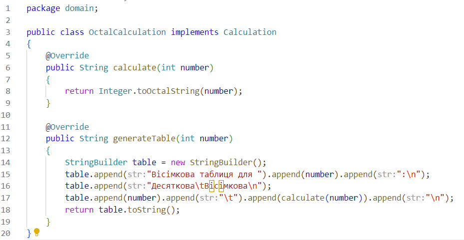
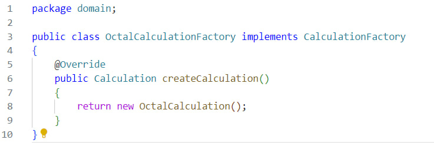
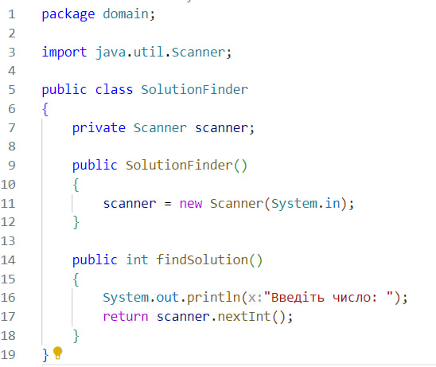
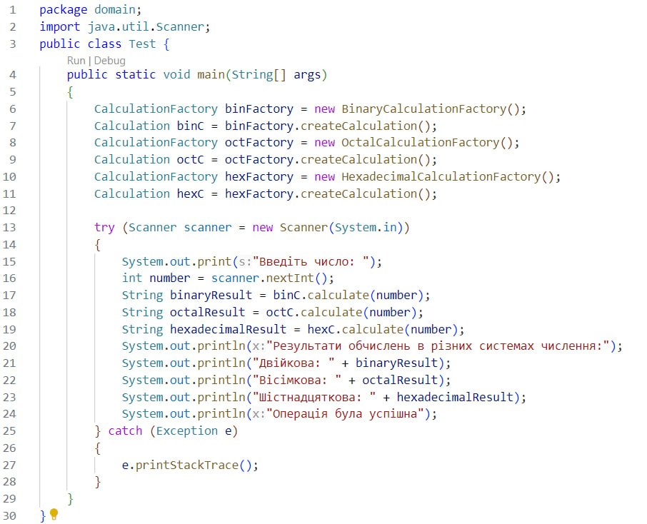
