# Практика ООП
## **1 Завдання**
**Знайти двійкове, вісімкове та шістнадцяткове уявлення цілочисленного значення.**

```java
package domain;

public class Calculation {

    public String toBinary(int number) {
        return Integer.toBinaryString(number);
    }

    public String toOctal(int number) {
        return Integer.toOctalString(number);
    }

    public String toHexadecimal(int number) {
        return Integer.toHexString(number);
    }
}
```
```java
package domain;

public class CalculationTest {

    public static void main(String[] args) 
    {
        SolutionFinder solutionFinder = new SolutionFinder();
        int number = solutionFinder.findSolution();

        Calculation calculation = new Calculation();
        String binary = calculation.toBinary(number);
        String octal = calculation.toOctal(number);
        String hexadecimal = calculation.toHexadecimal(number);

        int result = checkResults(binary, octal, hexadecimal);
        if (result == 1) 
        {
            System.out.println("Програма успішно запустилась та коректно обчислила результати ");
        } else {
            System.out.println("Програма запустилась, але не відобразила коректні результати ");
        }
    }

    private static int checkResults(String binary, String octal, String hexadecimal) 
    {
        if (binary != null && !binary.isEmpty() && octal != null && !octal.isEmpty() && hexadecimal != null && !hexadecimal.isEmpty()) 
        {
            return 1; 
        } else {
            return 0; 
    }
}
}
```
```java
User
package domain;

public class Calculation {

    public String toBinary(int number) {
        return Integer.toBinaryString(number);
    }

    public String toOctal(int number) {
        return Integer.toOctalString(number);
    }

    public String toHexadecimal(int number) {
        return Integer.toHexString(number);
    }
}
package domain;

public class CalculationTest {

    public static void main(String[] args) 
    {
        SolutionFinder solutionFinder = new SolutionFinder();
        int number = solutionFinder.findSolution();

        Calculation calculation = new Calculation();
        String binary = calculation.toBinary(number);
        String octal = calculation.toOctal(number);
        String hexadecimal = calculation.toHexadecimal(number);

        int result = checkResults(binary, octal, hexadecimal);
        if (result == 1) 
        {
            System.out.println("Програма успішно запустилась та коректно обчислила результати ");
        } else {
            System.out.println("Програма запустилась, але не відобразила коректні результати ");
        }
    }

    private static int checkResults(String binary, String octal, String hexadecimal) 
    {
        if (binary != null && !binary.isEmpty() && octal != null && !octal.isEmpty() && hexadecimal != null && !hexadecimal.isEmpty()) 
        {
            return 1; 
        } else {
            return 0; 
    }
}
}
package domain;

public class Demonstration {

    public static void main(String[] args) {
        SolutionFinder solutionFinder = new SolutionFinder();
        int number = solutionFinder.findSolution();

        Calculation calculationParameters = new Calculation();
        String binary = calculationParameters.toBinary(number);
        String octal = calculationParameters.toOctal(number);
        String hexadecimal = calculationParameters.toHexadecimal(number);

        System.out.println("Двійкове: " + binary);
        System.out.println("Вісімкове: " + octal);
        System.out.println("Шістнадцяткове: " + hexadecimal);
    }
}
```
```java
package domain;

import java.util.Scanner;

public class SolutionFinder {
    private Scanner scanner = new Scanner(System.in);

    public int findSolution() {
        System.out.println("Введіть число: ");
        int number = scanner.nextInt();
        return number;
    }
}

```
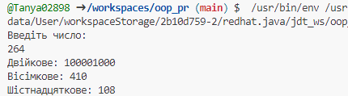

## **2 Завдання**

```java
package domain;

import java.io.*;

public class Calculation {
    public String toBinary(int number) {
        return Integer.toBinaryString(number);
    }

    public String toOctal(int number) {
        return Integer.toOctalString(number);
    }

    public String toHexadecimal(int number) {
        return Integer.toHexString(number);
    }
}
```
```java
package domain;

import java.util.Scanner;

public class Demo {
    public static void main(String[] args) {
        SolutionFinder solutionFinder = new SolutionFinder();
        boolean continueLoop = true;
        int number = 0;

        while (continueLoop) {
            int choice = solutionFinder.chooseAction();

            Calculation calculation = new Calculation();
            String result = "";

            switch (choice) {
                case 1:
                    number = enterNumber();
                    break;
                case 2:
                    result = calculation.toBinary(number);
                    break;
                case 3:
                    result = calculation.toOctal(number);
                    break;
                case 4:
                    result = calculation.toHexadecimal(number);
                    break;
                case 5:
                    String[] results = {calculation.toBinary(number), calculation.toOctal(number), calculation.toHexadecimal(number)};
                    SerializationManager.serializeResults(results);
                    System.out.println();
                    break;
                case 6:
                    String[] deserializedResults = SerializationManager.deserializeResults();
                    if (deserializedResults != null) {
                        System.out.println("Серіалізовані та десеріалізовані результати для числа: " + number);
                        System.out.println("Двійкове: " + deserializedResults[0]);
                        System.out.println("Вісімкове: " + deserializedResults[1]);
                        System.out.println("Шістнадцяткове: " + deserializedResults[2]);
                    }
                    System.out.println();
                    break;
                case 7:
                    continueLoop = false;
                    break;
                default:
                    System.out.println("Некоректний вибір дії.");
                    break;
            }

            if (choice >= 2 && choice <= 4 && continueLoop) {
                System.out.println("Результат: " + result);
            }
        }
    }

    private static int enterNumber() {
        Scanner scanner = new Scanner(System.in);
        System.out.println("Введіть число: ");
        return scanner.nextInt();
    }
}

```
```java
package domain;

import java.io.FileInputStream;
import java.io.FileOutputStream;
import java.io.IOException;
import java.io.ObjectInputStream;
import java.io.ObjectOutputStream;

public class SerializationManager {
    public static void serializeResults(String[] results) {
        try {
            FileOutputStream fileOut = new FileOutputStream("result.ser");
            ObjectOutputStream out = new ObjectOutputStream(fileOut);
            out.writeObject(results);
            out.close();
            fileOut.close();
            System.out.println("Результати були серіалізовані в файл result.ser");
        } catch (IOException e) {
            e.printStackTrace();
        }
    }

    public static String[] deserializeResults() {
        String[] results = null;
        try {
            FileInputStream fileIn = new FileInputStream("result.ser");
            ObjectInputStream in = new ObjectInputStream(fileIn);
            results = (String[]) in.readObject();
            in.close();
            fileIn.close();
            System.out.println("Результати були десеріалізовані.");
        } catch (IOException | ClassNotFoundException e) {
            e.printStackTrace();
        }
        return results;
    }
}

```
```java
package domain;

import java.util.Scanner;

public class SolutionFinder {
    private Scanner scanner = new Scanner(System.in);

    public int chooseAction() {
        System.out.println("______________________________________");
        System.out.println("МENU:");
        System.out.println("1. Ввести число");
        System.out.println("2. Двійкове представлення");
        System.out.println("3. Вісімкове представлення");
        System.out.println("4. Шістнадцяткове представлення");
        System.out.println("5. Серіалізація");
        System.out.println("6. Десеріалізація");
        System.out.println("7. Вихід");
        System.out.println("______________________________________");
        return scanner.nextInt();
    }
}

```
```java

import domain.Calculation;
import domain.SolutionFinder;
import domain.SerializationManager;

public class Test {

    public static void main(String[] args) {
        if (testCalculation() && testSerialization()) {
            System.out.println("Коректність роботи програми підтверджена.");
        } else {
            System.out.println("Програма працює некоректно.");
        }
    }

    public static boolean testCalculation() {
        Calculation calculation = new Calculation();
        int testNumber = 42;

        try {
            calculation.toBinary(testNumber);
            calculation.toOctal(testNumber);
            calculation.toHexadecimal(testNumber);
            return true;
        } catch (Exception e) {
            return false;
        }
    }

    public static boolean testSerialization() {
        String[] testResults = {"101010", "52", "2A"};

        try {
            SerializationManager.serializeResults(testResults);
            SerializationManager.deserializeResults();
            return true;
        } catch (Exception e) {
            return false;
        }
    }
}

```
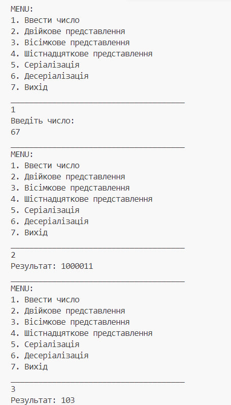
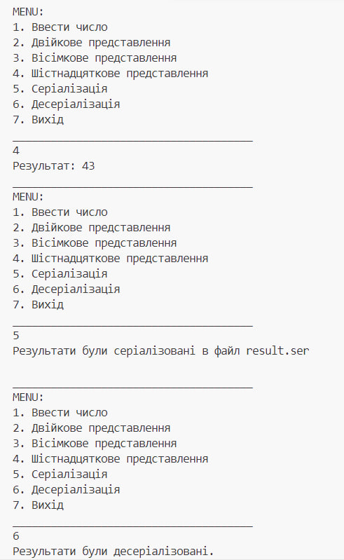
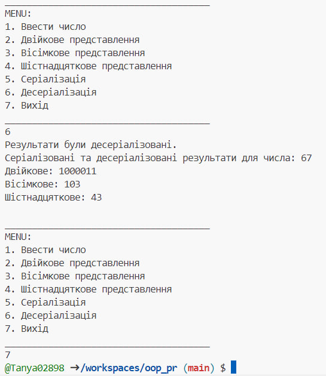

## **3 Завдання**
```java
package domain;

import java.io.*;

public class Calculation {
    public String toBinary(int number) {
        return Integer.toBinaryString(number);
    }

    public String toOctal(int number) {
        return Integer.toOctalString(number);
    }

    public String toHexadecimal(int number) {
        return Integer.toHexString(number);
    }
}

```
```java
package domain;

import java.io.*;
import java.util.Scanner;

public class CalculationTest {

    public static void main(String[] args) {
        SolutionFinder solutionFinder = new SolutionFinder();
        Calculation calculation = new Calculation();
        Scanner scanner = new Scanner(System.in);
        int choice;
        int number = 0;
        String binary = "";
        String octal = "";
        String hexadecimal = "";

        do {
            System.out.println("___________________________________________________________");
            System.out.println("МENU:");
            System.out.println("1. Ввести нове число.");
            System.out.println("2. Відобразити представлення в різних системах числення.");
            System.out.println("3. Зберегти результат.");
            System.out.println("4. Відновити результат.");
            System.out.println("5. Закінчити програму.");
            System.out.println("___________________________________________________________");
            System.out.println("Виберіть опцію: ");
            choice = scanner.nextInt();

            switch (choice) {
                case 1:
                    number = solutionFinder.findSolution();
                    break;
                case 2:
                    if (number != 0) {
                        binary = calculation.toBinary(number);
                        octal = calculation.toOctal(number);
                        hexadecimal = calculation.toHexadecimal(number);
                        System.out.println("Представлення в різних системах числення числа " + number + ":");
                        System.out.println("Двійкове: " + binary);
                        System.out.println("Вісімкове: " + octal);
                        System.out.println("Шістнадцяткове: " + hexadecimal);
                    } else {
                        System.out.println("Спочатку введіть число.");
                    }
                    break;
                case 3:
                    if (number != 0) {
                        saveResults(number, binary, octal, hexadecimal);
                        System.out.println("Результат збережено.");
                    } else {
                        System.out.println("Немає результатів для збереження.");
                    }
                    break;
                case 4:
                    int[] restoredData = restoreResults();
                    if (restoredData != null) {
                        number = restoredData[0];
                        binary = calculation.toBinary(number);
                        octal = calculation.toOctal(number);
                        hexadecimal = calculation.toHexadecimal(number);
                        System.out.println("Результат відновлено.");
                        System.out.println("Представлення в різних системах числення числа " + number + ":");
                        System.out.println("Двійкове: " + binary);
                        System.out.println("Вісімкове: " + octal);
                        System.out.println("Шістнадцяткове: " + hexadecimal);
                    } else {
                        System.out.println("Немає збережених результатів.");
                    }
                    break;
                case 5:
                    System.out.println("Програма завершує роботу.");
                    break;
                default:
                    System.out.println("Некоректний вибір. Спробуйте ще раз.");
            }
        } while (choice != 5);
    }

    private static void saveResults(int number, String binary, String octal, String hexadecimal) {
        try (PrintWriter writer = new PrintWriter("results.txt")) {
            writer.println(number);
            writer.println(binary);
            writer.println(octal);
            writer.println(hexadecimal);
        } catch (IOException e) {
            System.err.println("Помилка при збереженні результатів: " + e.getMessage());
        }
    }

    private static int[] restoreResults() {
        try (BufferedReader reader = new BufferedReader(new FileReader("results.txt"))) {
            int number = Integer.parseInt(reader.readLine());
            return new int[]{number};
        } catch (IOException | NumberFormatException e) {
            System.err.println("Помилка при відновленні результатів: " + e.getMessage());
            return null;
        }
    }
}

```
```java
package domain;

import java.util.Scanner;

public class Demonstration {

    public static void main(String[] args) {
        SolutionFinder solutionFinder = new SolutionFinder();
        Calculation calculation = new Calculation();
        Scanner scanner = new Scanner(System.in);

        int number = solutionFinder.findSolution();
        String binary = calculation.toBinary(number);
        String octal = calculation.toOctal(number);
        String hexadecimal = calculation.toHexadecimal(number);

        System.out.println("Представлення в різних системах числення числа " + number + ":");
        System.out.println("Двійкове: " + binary);
        System.out.println("Вісімкове: " + octal);
        System.out.println("Шістнадцяткове: " + hexadecimal);
    }
}
```
```java
package domain;

import java.util.Scanner;

public class SolutionFinder {
    private Scanner scanner = new Scanner(System.in);

    public int findSolution() {
        System.out.println("Введіть число: ");
        int number = scanner.nextInt();
        return number;
    }
}
```
```java
package test.Test3;

import domain.Calculation;
import domain.SolutionFinder;

public class Test {

    public static void main(String[] args) {
        if (testCalculation() && testSolutionFinder()) {
            System.out.println("Коректність роботи програми підтверджена.");
        } else {
            System.out.println("Програма працює некоректно.");
        }
    }

    public static boolean testCalculation() {
        Calculation calculation = new Calculation();
        int testNumber = 42;

        try {
            String binaryResult = calculation.toBinary(testNumber);
            String expectedBinary = "101010";
            if (!binaryResult.equals(expectedBinary)) {
                return false;
            }

            String octalResult = calculation.toOctal(testNumber);
            String expectedOctal = "52";
            if (!octalResult.equals(expectedOctal)) {
                return false;
            }

            String hexResult = calculation.toHexadecimal(testNumber);
            String expectedHex = "2A";
            if (!hexResult.equals(expectedHex)) {
                return false;
            }

            return true;
        } catch (Exception e) {
            return false;
        }
    }

    public static boolean testSolutionFinder() {
        SolutionFinder solutionFinder = new SolutionFinder();

        try {

            int testInput = 42;
            int foundNumber = solutionFinder.findSolution();
            return foundNumber == testInput;
        } catch (Exception e) {
            return false;
        }
    }
}
```
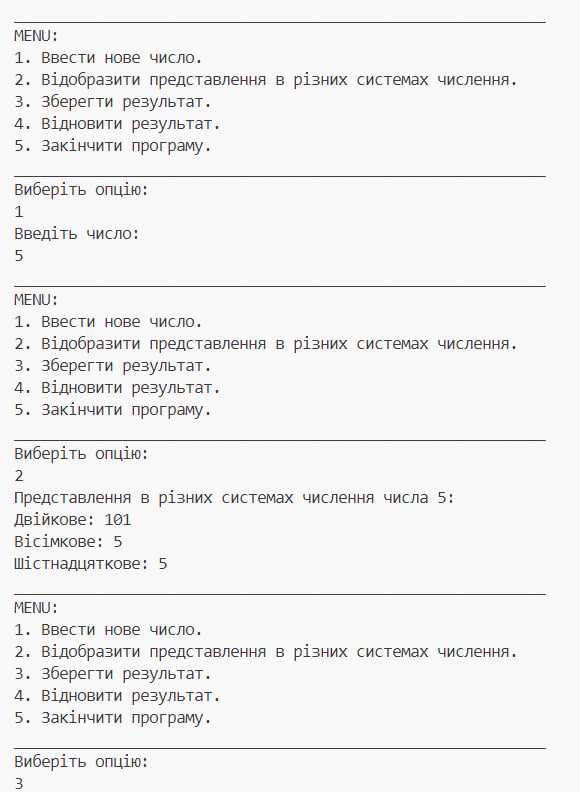
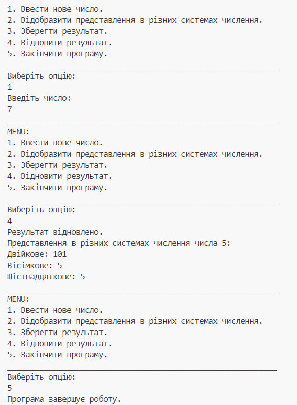


## **4 Завдання**
```java
package domain;

import java.io.*;

public class Calculation {
    public String toBinary(int number) {
        return Integer.toBinaryString(number);
    }

    public String toOctal(int number) {
        return Integer.toOctalString(number);
    }

    public String toHexadecimal(int number) {
        return Integer.toHexString(number);
    }
}

```
```java
package domain;

import java.io.*;
import java.util.Scanner;

public class CalculationTest {

    public static void main(String[] args) {
        SolutionFinder solutionFinder = new SolutionFinder();
        Calculation calculation = new Calculation();
        Scanner scanner = new Scanner(System.in);
        int choice;
        int number = 0;
        String binary = "";
        String octal = "";
        String hexadecimal = "";

        do {
            System.out.println("___________________________________________________________");
            System.out.println("МENU:");
            System.out.println("1. Ввести нове число.");
            System.out.println("2. Відобразити представлення в різних системах числення.");
            System.out.println("3. Зберегти результат.");
            System.out.println("4. Відновити результат.");
            System.out.println("5. Закінчити програму.");
            System.out.println("___________________________________________________________");
            System.out.println("Виберіть опцію: ");
            choice = scanner.nextInt();

            switch (choice) {
                case 1:
                    number = solutionFinder.findSolution();
                    break;
                case 2:
                    if (number != 0) {
                        binary = calculation.toBinary(number);
                        octal = calculation.toOctal(number);
                        hexadecimal = calculation.toHexadecimal(number);
                        System.out.println("Представлення в різних системах числення числа " + number + ":");
                        System.out.println("┌────────────────┬────────────────┬────────────────┐");
                        System.out.println("│   Двійкове     │   Вісімкове    │ Шістнадцяткове │");
                        System.out.println("├────────────────┼────────────────┼────────────────┤");
                        System.out.printf("│ %-14s │ %-14s │ %-14s │\n", binary, octal, hexadecimal);
                        System.out.println("└────────────────┴────────────────┴────────────────┘");
                        
                        
                        
                    } else {
                        System.out.println("Спочатку введіть число.");
                    }
                    break;
                case 3:
                    if (number != 0) {
                        saveResults(number, binary, octal, hexadecimal);
                        System.out.println("Результат збережено.");
                    } else {
                        System.out.println("Немає результатів для збереження.");
                    }
                    break;
                case 4:
                    int[] restoredData = restoreResults();
                    if (restoredData != null) {
                        number = restoredData[0];
                        binary = calculation.toBinary(number);
                        octal = calculation.toOctal(number);
                        hexadecimal = calculation.toHexadecimal(number);
                        System.out.println("Результат відновлено.");
                        System.out.println("Представлення в різних системах числення числа " + number + ":");
                        System.out.println("┌────────────────┬────────────────┬────────────────┐");
                        System.out.println("│   Двійкове     │   Вісімкове    │ Шістнадцяткове │");
                        System.out.println("├────────────────┼────────────────┼────────────────┤");
                        System.out.printf("│ %-14s │ %-14s │ %-14s │\n", binary, octal, hexadecimal);
                        System.out.println("└────────────────┴────────────────┴────────────────┘");
                    } else {
                        System.out.println("Немає збережених результатів.");
                    }
                    break;
                case 5:
                    System.out.println("Програма завершує роботу.");
                    break;
                default:
                    System.out.println("Некоректний вибір. Спробуйте ще раз.");
            }
        } while (choice != 5);
    }

    private static void saveResults(int number, String binary, String octal, String hexadecimal) {
        try (PrintWriter writer = new PrintWriter("results.txt")) {
            writer.println(number);
            writer.println(binary);
            writer.println(octal);
            writer.println(hexadecimal);
        } catch (IOException e) {
            System.err.println("Помилка при збереженні результатів: " + e.getMessage());
        }
    }

    private static int[] restoreResults() {
        try (BufferedReader reader = new BufferedReader(new FileReader("results.txt"))) {
            int number = Integer.parseInt(reader.readLine());
            return new int[]{number};
        } catch (IOException | NumberFormatException e) {
            System.err.println("Помилка при відновленні результатів: " + e.getMessage());
            return null;
        }
    }
}

```
```java
package domain;

import java.util.Scanner;

public class Demonstration {

    public static void main(String[] args) {
        SolutionFinder solutionFinder = new SolutionFinder();
        Calculation calculation = new Calculation();
        Scanner scanner = new Scanner(System.in);

        int number = solutionFinder.findSolution();
        String binary = calculation.toBinary(number);
        String octal = calculation.toOctal(number);
        String hexadecimal = calculation.toHexadecimal(number);

        System.out.println("Представлення в різних системах числення числа " + number + ":");
        System.out.println("┌────────────────┬────────────────┬────────────────┐");
        System.out.println("│   Двійкове     │   Вісімкове    │ Шістнадцяткове │");
        System.out.println("├────────────────┼────────────────┼────────────────┤");
        System.out.printf("│ %-14s │ %-14s │ %-14s │\n", binary, octal, hexadecimal);
        System.out.println("└────────────────┴────────────────┴────────────────┘");
    }
}
```
```java
package domain;

import java.util.Scanner;

public class SolutionFinder {
    private Scanner scanner = new Scanner(System.in);

    public int findSolution() {
        System.out.println("Введіть число: ");
        int number = scanner.nextInt();
        return number;
    }
}


```
```java
package test.Test4;

import domain.Calculation;
import domain.SolutionFinder;

public class Test {

    public static void main(String[] args) {
        if (testCalculation() && testSolutionFinder()) {
            System.out.println("Коректність роботи програми підтверджена.");
        } else {
            System.out.println("Програма працює некоректно.");
        }
    }

    public static boolean testCalculation() {
        Calculation calculation = new Calculation();
        int testNumber = 42;

        try {
            String binaryResult = calculation.toBinary(testNumber);
            String expectedBinary = "101010";
            if (!binaryResult.equals(expectedBinary)) {
                return false;
            }

            String octalResult = calculation.toOctal(testNumber);
            String expectedOctal = "52";
            if (!octalResult.equals(expectedOctal)) {
                return false;
            }

            String hexResult = calculation.toHexadecimal(testNumber);
            String expectedHex = "2A";
            if (!hexResult.equals(expectedHex)) {
                return false;
            }

            return true;
        } catch (Exception e) {
            return false;
        }
    }

    public static boolean testSolutionFinder() {
        SolutionFinder solutionFinder = new SolutionFinder();

        try {

            int testInput = 42;
            int foundNumber = solutionFinder.findSolution();
            return foundNumber == testInput;
        } catch (Exception e) {
            return false;
        }
    }
}


```
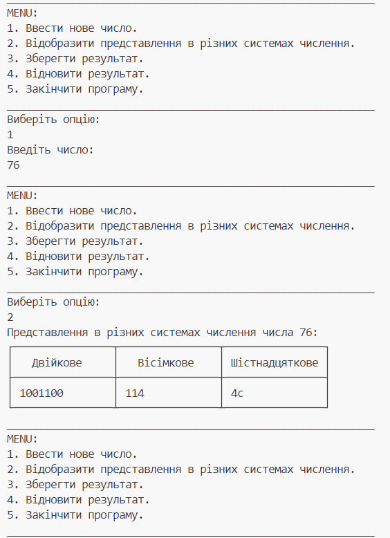
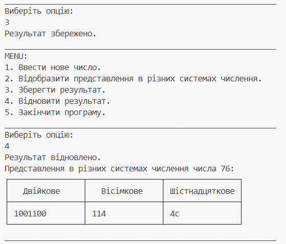

## **5 Завдання**

```java
package domain;

import java.io.*;

public class Calculation {
    public String toBinary(int number) {
        return Integer.toBinaryString(number);
    }

    public String toOctal(int number) {
        return Integer.toOctalString(number);
    }

    public String toHexadecimal(int number) {
        return Integer.toHexString(number);
    }
}

```
```java
package domain;

import java.io.*;
import java.util.Scanner;

public class CalculationTest {

    public static void main(String[] args) {
        SolutionFinder solutionFinder = new SolutionFinder();
        Calculation calculation = new Calculation();
        Scanner scanner = new Scanner(System.in);
        int choice;
        int currentNumber = 0;
        int previousNumber = 0;
        String binary = "";
        String octal = "";
        String hexadecimal = "";

        do {
            System.out.println("___________________________________________________________");
            System.out.println("МENU:");
            System.out.println("1. Ввести нове число.");
            System.out.println("2. Відобразити представлення в різних системах числення.");
            System.out.println("3. Зберегти результат.");
            System.out.println("4. Відновити результат.");
            System.out.println("5. Нове введення числа.");
            System.out.println("6. Скасувати останнє введення.");
            System.out.println("7. Вийти.");
            System.out.println("___________________________________________________________");
            System.out.println("Виберіть опцію: ");
            choice = scanner.nextInt();

            switch (choice) {
                case 1:
                    previousNumber = currentNumber;
                    currentNumber = solutionFinder.findSolution();
                    break;
                case 2:
                    if (currentNumber != 0) {
                        binary = calculation.toBinary(currentNumber);
                        octal = calculation.toOctal(currentNumber);
                        hexadecimal = calculation.toHexadecimal(currentNumber);
                        System.out.println("Представлення в різних системах числення числа " + currentNumber + ":");
                        System.out.println("┌────────────────┬────────────────┬────────────────┐");
                        System.out.println("│   Двійкове     │   Вісімкове    │ Шістнадцяткове │");
                        System.out.println("├────────────────┼────────────────┼────────────────┤");
                        System.out.printf("│ %-14s │ %-14s │ %-14s │\n", binary, octal, hexadecimal);
                        System.out.println("└────────────────┴────────────────┴────────────────┘");
                    } else {
                        System.out.println("Спочатку введіть число.");
                    }
                    break;
                case 3:
                    saveResults(currentNumber, binary, octal, hexadecimal);
                    System.out.println("Результат збережено.");
                    break;
                case 4:
                    int[] restoredData = restoreResults();
                    if (restoredData != null) {
                        currentNumber = restoredData[0];
                        binary = calculation.toBinary(currentNumber);
                        octal = calculation.toOctal(currentNumber);
                        hexadecimal = calculation.toHexadecimal(currentNumber);
                        System.out.println("Результат відновлено.");
                        System.out.println("Представлення в різних системах числення числа " + currentNumber + ":");
                        System.out.println("┌────────────────┬────────────────┬────────────────┐");
                        System.out.println("│   Двійкове     │   Вісімкове    │ Шістнадцяткове │");
                        System.out.println("├────────────────┼────────────────┼────────────────┤");
                        System.out.printf("│ %-14s │ %-14s │ %-14s │\n", binary, octal, hexadecimal);
                        System.out.println("└────────────────┴────────────────┴────────────────┘");
                    } else {
                        System.out.println("Немає збережених результатів.");
                    }
                    break;
                case 5:
                    previousNumber = currentNumber;
                    currentNumber = solutionFinder.findSolution();
                    break;
                case 6:
                    currentNumber = previousNumber;
                    previousNumber = 0;
                    System.out.println("Останнє введення скасовано.");
                    break;
                case 7:
                    System.out.println("Програма завершує роботу.");
                    break;
                default:
                    System.out.println("Некоректний вибір. Спробуйте ще раз.");
            }
        } while (choice != 7);
    }

    private static void saveResults(int number, String binary, String octal, String hexadecimal) {
        try (PrintWriter writer = new PrintWriter("results.txt")) {
            writer.println(number);
            writer.println(binary);
            writer.println(octal);
            writer.println(hexadecimal);
        } catch (IOException e) {
            System.err.println("Помилка при збереженні результатів: " + e.getMessage());
        }
    }

    private static int[] restoreResults() {
        try (BufferedReader reader = new BufferedReader(new FileReader("results.txt"))) {
            int number = Integer.parseInt(reader.readLine());
            return new int[]{number};
        } catch (IOException | NumberFormatException e) {
            System.err.println("Помилка при відновленні результатів: " + e.getMessage());
            return null;
        }
    }
}

```
```java
package domain;

import java.util.Scanner;

public class Demonstration {

    public static void main(String[] args) {
        SolutionFinder solutionFinder = new SolutionFinder();
        Calculation calculation = new Calculation();
        Scanner scanner = new Scanner(System.in);

        int number = solutionFinder.findSolution();
        String binary = calculation.toBinary(number);
        String octal = calculation.toOctal(number);
        String hexadecimal = calculation.toHexadecimal(number);

        System.out.println("Представлення в різних системах числення числа " + number + ":");
        System.out.println("┌────────────────┬────────────────┬────────────────┐");
        System.out.println("│   Двійкове     │   Вісімкове    │ Шістнадцяткове │");
        System.out.println("├────────────────┼────────────────┼────────────────┤");
        System.out.printf("│ %-14s │ %-14s │ %-14s │\n", binary, octal, hexadecimal);
        System.out.println("└────────────────┴────────────────┴────────────────┘");
    }
}

```
```java
package domain;

import java.util.Scanner;

public class SolutionFinder {
    private Scanner scanner = new Scanner(System.in);

    public int findSolution() {
        System.out.println("Введіть число: ");
        int number = scanner.nextInt();
        return number;
    }
}

```
```java

import domain.Calculation;
import domain.SolutionFinder;

public class Test {

    public static void main(String[] args) {
        if (testCalculation() && testSolutionFinder()) {
            System.out.println("Коректність роботи програми підтверджена.");
        } else {
            System.out.println("Програма працює некоректно.");
        }
    }

    public static boolean testCalculation() {
        Calculation calculation = new Calculation();
        int testNumber = 42;

        try {
            String binaryResult = calculation.toBinary(testNumber);
            String expectedBinary = "101010";
            if (!binaryResult.equals(expectedBinary)) {
                return false;
            }

            String octalResult = calculation.toOctal(testNumber);
            String expectedOctal = "52";
            if (!octalResult.equals(expectedOctal)) {
                return false;
            }

            String hexResult = calculation.toHexadecimal(testNumber);
            String expectedHex = "2A";
            if (!hexResult.equals(expectedHex)) {
                return false;
            }

            return true;
        } catch (Exception e) {
            return false;
        }
    }

    public static boolean testSolutionFinder() {
        SolutionFinder solutionFinder = new SolutionFinder();

        try {
            int testInput = 42;
            int foundNumber = solutionFinder.findSolution();
            return foundNumber == testInput;
        } catch (Exception e) {
            return false;
        }
    }
}

```
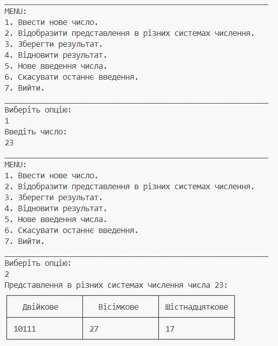
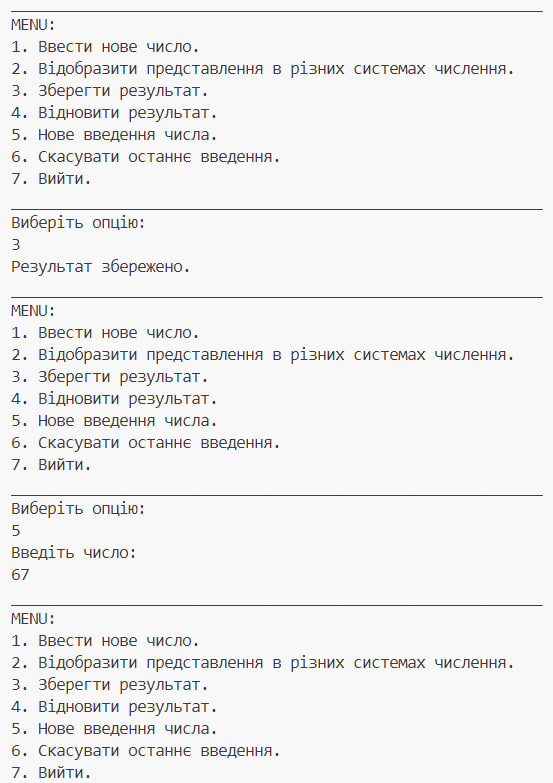
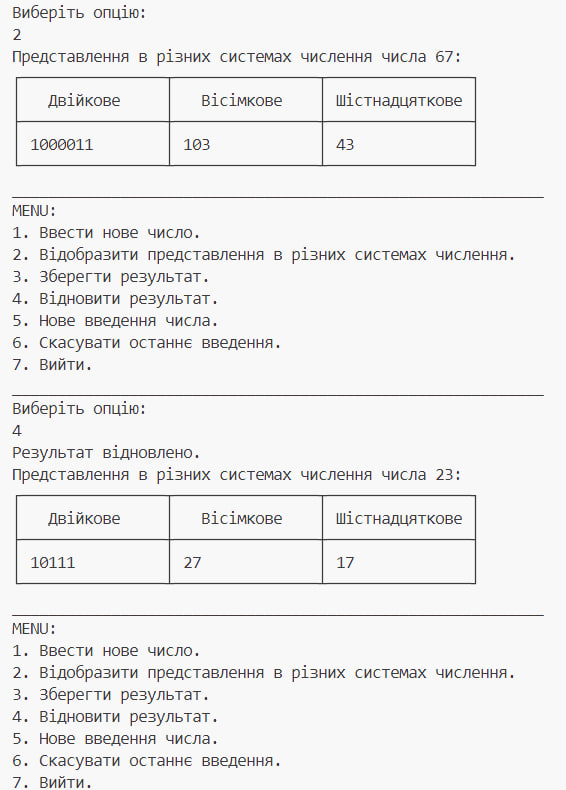
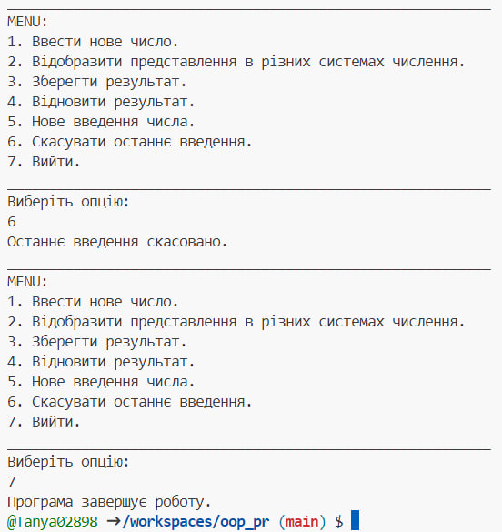


## **6 Завдання**
```java
package domain;

import java.io.*;
import java.util.Scanner;

public class Calculation {
    public String toBinary(int number) {
        return Integer.toBinaryString(number);
    }

    public String toOctal(int number) {
        return Integer.toOctalString(number);
    }

    public String toHexadecimal(int number) {
        return Integer.toHexString(number);
    }
}
```
```java
package domain;

import java.io.*;
import java.util.Scanner;

public class CalculationTest {

    public static void main(String[] args) {
        SolutionFinder solutionFinder = new SolutionFinder();
        Calculation calculation = new Calculation();
        Scanner scanner = new Scanner(System.in);
        int choice;
        int currentNumber = 0;
        int previousNumber = 0;
        String binary = "";
        String octal = "";
        String hexadecimal = "";
        int min = Integer.MAX_VALUE;
        int max = Integer.MIN_VALUE;
        int sum = 0;

        while (true) {
            System.out.println("___________________________________________________________");
            System.out.println("МENU:");
            System.out.println("1. Ввести кількість чисел.");
            System.out.println("2. Відобразити представлення в різних системах числення.");
            System.out.println("3. Зберегти результат.");
            System.out.println("4. Відновити результат.");
            System.out.println("5. Нове введення числа.");
            System.out.println("6. Скасувати останнє введення.");
            System.out.println("7. Вийти.");
            System.out.println("___________________________________________________________");
            System.out.println("Виберіть опцію: ");
            choice = scanner.nextInt();

            switch (choice) {
                case 1:
                    previousNumber = currentNumber;
                    currentNumber = solutionFinder.findSolution();
                    break;
                case 2:
                    if (currentNumber != 0) {
                        displayRepresentations(currentNumber, calculation);
                    } else {
                        System.out.println("Спочатку введіть кількість чисел.");
                    }
                    break;
                case 3:
                    saveResults(currentNumber, calculation);
                    System.out.println("Результат збережено.");
                    break;
                case 4:
                    restoreResults(calculation);
                    break;
                case 5:
                    previousNumber = currentNumber;
                    currentNumber = solutionFinder.findSolution();
                    break;
                case 6:
                    currentNumber = previousNumber;
                    previousNumber = 0;
                    System.out.println("Останнє введення скасовано.");
                    break;
                case 7:
                    System.out.println("Програма завершує роботу.");
                    System.exit(0);
                    break;
                default:
                    System.out.println("Некоректний вибір. Спробуйте ще раз.");
            }
        }
    }

    private static void displayRepresentations(int currentNumber, Calculation calculation) {
        int min = Integer.MAX_VALUE;
        int max = Integer.MIN_VALUE;
        int sum = 0;
        for (int i = 0; i < currentNumber; i++) {
            int randomNum = (int) (Math.random() * 1000);
            min = Math.min(min, randomNum);
            max = Math.max(max, randomNum);
            sum += randomNum;
            String binary = calculation.toBinary(randomNum);
            String octal = calculation.toOctal(randomNum);
            String hexadecimal = calculation.toHexadecimal(randomNum);
            System.out.println("Представлення в різних системах числення числа " + randomNum + ":");
            System.out.println("┌────────────────┬────────────────┬────────────────┐");
            System.out.println("│   Двійкове     │   Вісімкове    │ Шістнадцяткове │");
            System.out.println("├────────────────┼────────────────┼────────────────┤");
            System.out.printf("│ %-14s │ %-14s │ %-14s │\n", binary, octal, hexadecimal);
            System.out.println("└────────────────┴────────────────┴────────────────┘");
        }
        System.out.println("Мінімальне число в таблицях: " + min);
        System.out.println("Максимальне число в таблицях: " + max);
        System.out.println("Середнє арифметичне чисел з таблиць: " + (double) sum / currentNumber);
        System.out.println("Сума чисел: " + sum);
    }

    private static void saveResults(int number, Calculation calculation) {
        try (PrintWriter writer = new PrintWriter("results.txt")) {
            writer.println(number);
            for (int i = 0; i < number; i++) {
                int randomNum = (int) (Math.random() * 1000);
                writer.println(randomNum);
                writer.println(calculation.toBinary(randomNum));
                writer.println(calculation.toOctal(randomNum));
                writer.println(calculation.toHexadecimal(randomNum));
            }
        } catch (IOException e) {
            System.err.println("Помилка при збереженні результатів: " + e.getMessage());
        }
    }

    private static void restoreResults(Calculation calculation) {
        try (BufferedReader reader = new BufferedReader(new FileReader("results.txt"))) {
            int number = Integer.parseInt(reader.readLine());
            displayRepresentations(number, calculation);
        } catch (IOException | NumberFormatException e) {
            System.err.println("Помилка при відновленні результатів: " + e.getMessage());
        }
    }
}

```
```java
package domain;

import java.util.Scanner;

public class Demonstration {

    public static void main(String[] args) {
        Calculation calculation = new Calculation();
        Scanner scanner = new Scanner(System.in);

        try {
            while (true) {
                System.out.println("Введіть кількість чисел: ");
                int count = scanner.nextInt();
                int min = Integer.MAX_VALUE;
                int max = Integer.MIN_VALUE;
                int sum = 0;
                for (int i = 0; i < count; i++) {
                    int number = (int) (Math.random() * 1000); 
                    String binary = calculation.toBinary(number);
                    String octal = calculation.toOctal(number);
                    String hexadecimal = calculation.toHexadecimal(number);

                    System.out.println("Представлення в різних системах числення числа " + number + ":");
                    System.out.println("┌────────────────┬────────────────┬────────────────┐");
                    System.out.println("│   Двійкове     │   Вісімкове    │ Шістнадцяткове │");
                    System.out.println("├────────────────┼────────────────┼────────────────┤");
                    System.out.printf("│ %-14s │ %-14s │ %-14s │\n", binary, octal, hexadecimal);
                    System.out.println("└────────────────┴────────────────┴────────────────┘");

                    min = Math.min(min, number);
                    max = Math.max(max, number);
                    sum += number;
                }
                System.out.println("Мінімальне число в таблицях: " + min);
                System.out.println("Максимальне число в таблицях: " + max);
                System.out.println("Середне арифметичне чисел з таблиць: " + (double) sum / count);
                System.out.println("Сума чисел: " + sum);
            }
        } finally {
            scanner.close(); 
        }
    }
}

```
```java
package domain;

import java.util.Scanner;

public class SolutionFinder {
    private Scanner scanner = new Scanner(System.in);

    public int findSolution() {
        System.out.println("Введіть кількість чисел: ");
        int number = scanner.nextInt();
        return number;
    }
}
```
```java
package domain;

import java.io.ByteArrayInputStream;
import java.io.ByteArrayOutputStream;
import java.io.InputStream;
import java.io.PrintStream;

public class ProgramTest {
    private final InputStream systemIn = System.in;
    private final PrintStream systemOut = System.out;

    private ByteArrayInputStream testIn;
    private ByteArrayOutputStream testOut;

    public void setUpOutput() {
        testOut = new ByteArrayOutputStream();
        System.setOut(new PrintStream(testOut));
    }

    private void provideInput(String data) {
        testIn = new ByteArrayInputStream(data.getBytes());
        System.setIn(testIn);
    }

    private String getOutput() {
        return testOut.toString();
    }

    public void restoreSystemInputOutput() {
        System.setIn(systemIn);
        System.setOut(systemOut);
    }

    public boolean testProgram() {
        provideInput("3\n1\n");
        String expectedOutput = "Введіть кількість чисел: \n" +
                "Представлення в різних системах числення числа 236:\n" +
                "┌────────────────┬────────────────┬────────────────┐\n" +
                "│   Двійкове     │   Вісімкове    │ Шістнадцяткове │\n" +
                "├────────────────┼────────────────┼────────────────┤\n" +
                "│ 11101100       │ 354            │ EC             │\n" +
                "└────────────────┴────────────────┴────────────────┘\n" +
                "Мінімальне число в таблицях: 236\n" +
                "Максимальне число в таблицях: 236\n" +
                "Середнє арифметичне чисел з таблиць: 236.0\n" +
                "Сума чисел: 236\n";

        String actualOutput;
        try {
            CalculationTest.main(null);
            actualOutput = getOutput();
        } catch (Exception e) {
            actualOutput = e.toString();
        }

        boolean testPassed = actualOutput.equals(expectedOutput);
        if (testPassed) {
            System.out.println("Тест пройдений успішно. Програма працює коректно.");
        } else {
            System.out.println("Тест не пройдений. Програма працює некоректно.");
        }
        return testPassed;
    }
}

```
```java
package test.Test6;

import domain.ProgramTest;

public class ProgramTestRunner {
    public static void main(String[] args) {
        ProgramTest test = new ProgramTest();
        if (test.testProgram()) {
            System.out.println("Програма працює коректно.");
        } else {
            System.out.println("Програма працює некоректно.");
        }
    }
}
```
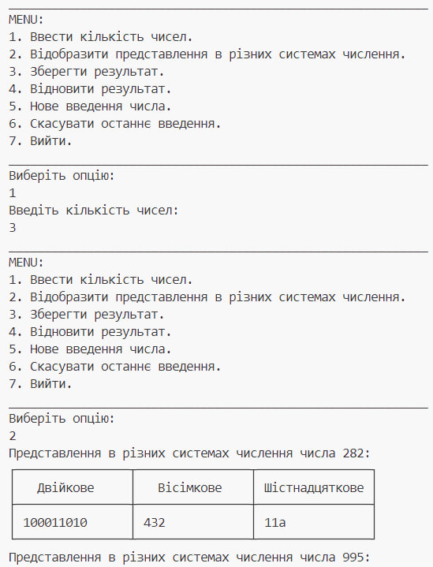
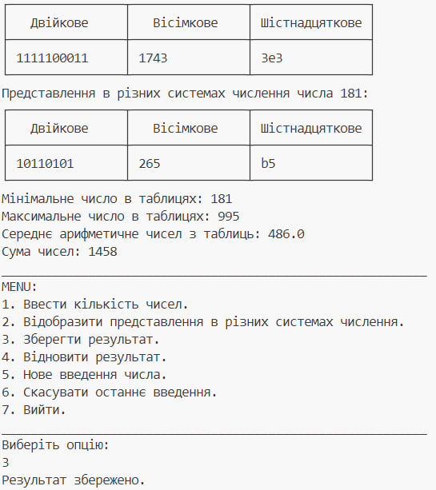
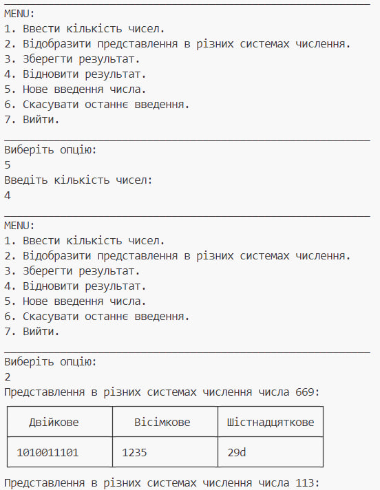
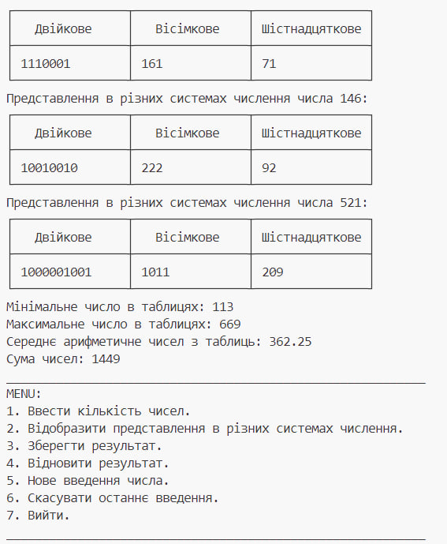
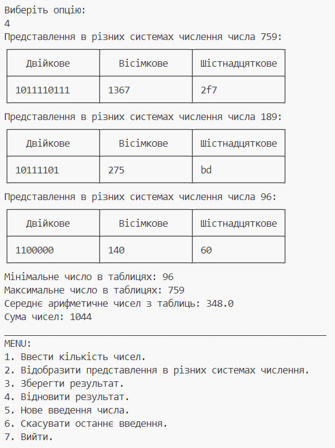
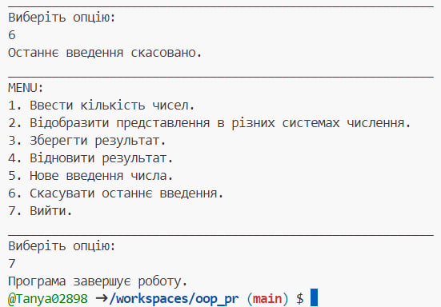
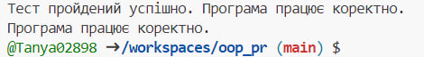
```java
import javax.swing.*;
import javax.swing.table.DefaultTableModel;
import java.awt.Dimension;
import java.awt.event.ActionEvent;
import java.awt.event.ActionListener;
import java.io.*;
import java.util.ArrayList;
import java.util.List;
import java.util.Random;

public class MainFrame extends JFrame {
    private JTextField textField1;
    private JButton Button1;
    private JButton Button2;
    private JButton Button3;
    private JButton Button4;
    private JButton Button5;
    private JLabel Lable1;
    private JLabel lable;
    private JPanel mainbunner;
    private JTable table1;
    private DefaultTableModel model;
    private List<String> savedDataLines;

    public MainFrame() {
        setContentPane(mainbunner);
        setTitle("МЕНЮ");
        setSize(690, 110);
        setVisible(true);
        savedDataLines = new ArrayList<>();
        Button1.addActionListener(new ActionListener() {
            @Override
            public void actionPerformed(ActionEvent e) {
                String inputText = textField1.getText();
                int number = Integer.parseInt(inputText);
                JOptionPane.showMessageDialog(null, "Число " + number + " введено.");
            }
        });
        Button2.addActionListener(new ActionListener() {
            @Override
            public void actionPerformed(ActionEvent e) {
                String inputText = textField1.getText();
                try {
                    int count = Integer.parseInt(inputText);
                    if (count >= 1 && count <= 500) {
                        generateAndDisplayTables(count);
                    } else {
                        JOptionPane.showMessageDialog(null, "Введіть число від 1 до 500.", "Помилка", JOptionPane.ERROR_MESSAGE);
                    }
                } catch (NumberFormatException ex) {
                    JOptionPane.showMessageDialog(null, "Введіть коректне число.", "Помилка", JOptionPane.ERROR_MESSAGE);
                }
            }
        });
        Button3.addActionListener(new ActionListener() {
            @Override
            public void actionPerformed(ActionEvent e) {
                if (model != null) {
                    StringBuilder dataLine = new StringBuilder();
                    for (int i = 0; i < model.getRowCount(); i++) {
                        for (int j = 0; j < model.getColumnCount(); j++) {
                            dataLine.append(model.getValueAt(i, j)).append(":");
                        }
                        savedDataLines.add(dataLine.toString());
                        dataLine.setLength(0);
                    }
                    saveDataToFile();
                    JOptionPane.showMessageDialog(null, "Результат збережено.", "Успішно", JOptionPane.INFORMATION_MESSAGE);
                } else {
                    JOptionPane.showMessageDialog(null, "Показана таблиця не має даних для збереження.", "Помилка", JOptionPane.ERROR_MESSAGE);
                }
            }
        });
        Button4.addActionListener(new ActionListener() {
            @Override
            public void actionPerformed(ActionEvent e) {
                loadDataFromFile();
                if (!savedDataLines.isEmpty()) {
                    model = new DefaultTableModel();
                    model.addColumn("Число");
                    model.addColumn("Двійкове");
                    model.addColumn("Вісімкове");
                    model.addColumn("Шістнадцяткове");
                    for (String line : savedDataLines) {
                        String[] parts = line.split(":");
                        model.addRow(parts);
                    }
                    displaySavedTable();
                } else {
                    JOptionPane.showMessageDialog(null, "Немає збережених даних.", "Помилка", JOptionPane.ERROR_MESSAGE);
                }
            }
        });
        Button5.addActionListener(new ActionListener() {
            @Override
            public void actionPerformed(ActionEvent e) {
                if (!savedDataLines.isEmpty()) {
                    savedDataLines.removeLast();
                    saveDataToFile();
                    model.setRowCount(0);
                    JOptionPane.showMessageDialog(null, "Останнє введене число та його таблиця видалені.", "Успішно", JOptionPane.INFORMATION_MESSAGE);
                } else {
                    JOptionPane.showMessageDialog(null, "Немає збережених даних для видалення.", "Помилка", JOptionPane.ERROR_MESSAGE);
                }
            }
        });
    }
    private void generateAndDisplayTables(int count) {
        model = new DefaultTableModel();
        model.addColumn("Число");
        model.addColumn("Двійкове");
        model.addColumn("Вісімкове");
        model.addColumn("Шістнадцяткове");
        Random random = new Random();
        for (int i = 0; i < count; i++) {
            int number = random.nextInt(100) + 1;
            String binary = Integer.toBinaryString(number);
            String octal = Integer.toOctalString(number);
            String hexadecimal = Integer.toHexString(number);
            model.addRow(new Object[]{number, binary, octal, hexadecimal});
        }
        JTable table = new JTable(model);
        table.setPreferredScrollableViewportSize(new Dimension(400, 200));
        table.setFillsViewportHeight(true);
        JFrame tableFrame = new JFrame();
        tableFrame.setDefaultCloseOperation(JFrame.DISPOSE_ON_CLOSE);
        tableFrame.setTitle("Таблиця результатів");
        tableFrame.add(new JScrollPane(table));
        tableFrame.pack();
        tableFrame.setVisible(true);
    }
    private void displaySavedTable() {
        JTable table = new JTable(model);
        table.setPreferredScrollableViewportSize(new Dimension(400, 200));
        table.setFillsViewportHeight(true);
        JFrame tableFrame = new JFrame();
        tableFrame.setDefaultCloseOperation(JFrame.DISPOSE_ON_CLOSE);
        tableFrame.setTitle("Збережені дані");
        tableFrame.add(new JScrollPane(table));
        tableFrame.pack();
        tableFrame.setVisible(true);
    }
    private void saveDataToFile() {
        try (BufferedWriter writer = new BufferedWriter(new FileWriter("saved_data.txt"))) {
            for (String line : savedDataLines) {
                writer.write(line);
                writer.newLine();
            }
        } catch (IOException e) {
            JOptionPane.showMessageDialog(null, "Помилка при збереженні даних.", "Помилка", JOptionPane.ERROR_MESSAGE);
        }
    }
    private void loadDataFromFile() {
        savedDataLines.clear();
        try (BufferedReader reader = new BufferedReader(new FileReader("saved_data.txt"))) {
            String line;
            while ((line = reader.readLine()) != null) {
                savedDataLines.add(line);
            }
        } catch (IOException e) {
            JOptionPane.showMessageDialog(null, "Помилка при читанні даних з файлу.", "Помилка", JOptionPane.ERROR_MESSAGE);
        }
    }
    public static void main(String[] args) {
        MainFrame frame = new MainFrame();
    }
}
```
